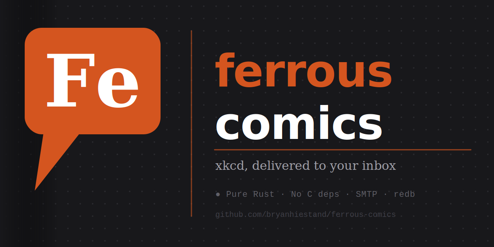

# ferrous-comics



[](https://github.com/bryanhiestand/ferrous-comics/actions/workflows/ci.yml)
[](LICENSE)

Emails the latest xkcd comic to the recipient specified in settings.

Checks xkcd's latest comic using the xkcd API at <https://xkcd.com/info.0.json>

If the latest comic is new, emails it to the configured recipient and records it
as seen. Optionally downloads comics to `./comics/`

## Installation

1. Clone this repo
1. Copy `example.env` to `.env` and fill in your SMTP credentials
1. `cargo build --release`
1. Run: `./target/release/ferrous-comics`
1. The binary will create `xkcd_comics.db` and (if `XKCD_DOWNLOAD=true`) a `comics/` directory. If `xkcd_history.txt` exists from a previous version it will be automatically migrated and renamed to `xkcd_history.txt.migrated`
1. (optional) Install as a cron job

## Dependencies

* Rust / Cargo

## Configuration

All settings are read from environment variables (or a `.env` file) with the `XKCD_` prefix:

| Variable | Required | Default | Description |
|---|---|---|---|
| `XKCD_MAIL_TO` | yes | — | Recipient email address (comma-separated for multiple) |
| `XKCD_MAIL_FROM` | yes | — | Sender email address |
| `XKCD_SMTP_SERVER` | yes | — | SMTP hostname |
| `XKCD_SMTP_PORT` | no | `587` | SMTP port |
| `XKCD_SMTP_STARTTLS` | no | `true` | Use STARTTLS |
| `XKCD_SMTP_USERNAME` | no | — | SMTP username |
| `XKCD_SMTP_PASSWORD` | no | — | SMTP password |
| `XKCD_DOWNLOAD` | no | `true` | Download comic image locally |
| `XKCD_MAIL_ATTACHMENT` | no | `false` | Attach image to email (requires `XKCD_DOWNLOAD=true`) |
| `XKCD_DB_PATH` | no | `xkcd_comics.db` | Path to the comic history database |
| `XKCD_BACKFILL_LIMIT` | no | `5` | Max comics to send per run when catching up after a missed day; `0` to disable backfill |

Set `RUST_LOG=debug` for verbose output.

## Database

Comic history is stored in `xkcd_comics.db` (a [redb](https://github.com/cberner/redb) embedded database). Each record is a JSON object:

```json
{"num":3222,"first_seen_utc":1742563200,"image_downloaded":true,"email_sent":true,"email_sent_utc":1742563205}
```

Fields:

| Field | Description |
|---|---|
| `num` | xkcd comic number |
| `first_seen_utc` | Unix timestamp when the comic was first noticed (`0` = imported from legacy file) |
| `image_downloaded` | Whether the image was successfully saved to `comics/` |
| `email_sent` | Whether the email was successfully sent |
| `email_sent_utc` | Unix timestamp of the successful send, or `null` |

### Inspect the database

Dump all records as newline-delimited JSON:

```bash
ferrous-comics dump
# or during development:
make dump
```

Pretty-print a single record by comic number (requires `jq`):

```bash
ferrous-comics dump | jq 'select(.num == 3222)'
```

List comics where the email was not sent:

```bash
ferrous-comics dump | jq 'select(.email_sent == false)'
```

Count total comics seen:

```bash
ferrous-comics dump | wc -l
```

Convert `first_seen_utc` to a readable date (requires `jq` and `date`):

```bash
ferrous-comics dump | jq '.first_seen_utc' | xargs -I{} date -r {}
```

## Limitations

* Must have file write access in the binary's working directory
* Only supports SMTP

## TODO

* Test other email providers
